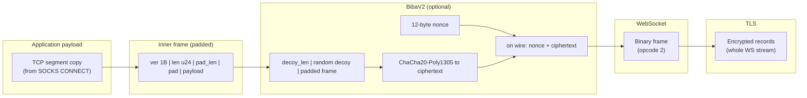
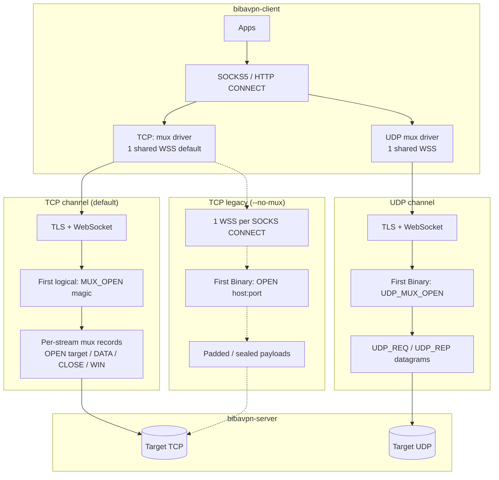
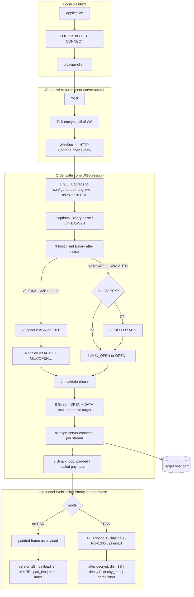

# BibaVPN — protocol and wire formats

BibaVPN is a local **SOCKS5** (and optional **HTTP CONNECT**) front that tunnels
traffic over **TLS + WebSocket** to a remote entry server, which in turn dials
the target `host:port` over **TCP** (with a dedicated mux for **UDP**).

This document specifies the on-wire layers. For install / run instructions see
**[README.md](README.md)**; for contributor notes see **[AGENTS.md](AGENTS.md)**.

---

## Contents

- [Stack at a glance](#stack-at-a-glance)
- [Biba v2 vs v3 (handshake and control)](#biba-v2-vs-v3-handshake-and-control)
- [TCP vs UDP paths](#tcp-vs-udp-paths)
- [Wire formats (packets and frames)](#wire-formats-packets-and-frames)
- [End-to-end picture (session flow)](#end-to-end-picture-session-flow)
- [Encrypted invite `biba://`](#encrypted-invite-biba)

---

## Stack at a glance

How one byte from your app is wrapped before it leaves the machine toward the VPS (TCP tunnel). Each layer is opaque to the one below; DPI on the link sees **TLS record traffic** and, inside it, **WebSocket frames**.



Without PSK, **L5** is skipped: the WebSocket Binary payload **is** the padded frame from **L6**. Padding length can follow **uniform random** or **HTTP-like size buckets** (`--pad-mode`).

With PSK, **L5** uses ChaCha20-Poly1305 in both **v2** and **v3**; they differ in how the session keys and handshake bytes are derived (see next section).

---

## Biba v2 vs v3 (handshake and control)

Both versions share the **same outer record shape**: optional decoy, then padded inner payload, inside **12-byte nonce + AEAD ciphertext** per WebSocket Binary (see §2). **v3** changes only the **PSK handshake** and **how cleartext control messages are encoded before encryption**.

### Negotiation (NewPath — default WebSocket entry)

After the HTTP Upgrade, the client may send optional **noise** (`--junk-frames`, `--early-ws-frames`). The server then inspects the first meaningful **client → server** Binary:

1. If it parses as legacy **AUTH** (`BIBA\x01AUTH\x00` …), the session follows **v2**: optional **BIBV2HL1** / **BIBV2ACK1** PSK handshake if PSK is enabled, with v2 KDF labels (`bibavpn.v2.*`).
2. If it is **33 bytes** and starts with byte **`0x03`**, the session follows **v3**: opaque client random (32 B). The server must have **PSK** configured; it replies with **32 B server random ∥ 16 B MAC** (no ASCII magic). MAC and directional keys use **domain-separated** derivation (`bibavpn.v3.mac.psk`, `bibavpn.v3.c2s`, `bibavpn.v3.s2c`) with a shared **domain string** (server `--proto-domain`, client `--proto-domain` or invite `proto_domain`; if the client string is empty, the **SNI** is used).

Mismatching domain strings break the MAC and the session. **v3 requires PSK** on the client when `proto == 3`.

### v3 inner control opcodes (plaintext *inside* AEAD, not on the wire bare)

These replace the ASCII `BIBA\x01…` **control** magics for v3 paths. The client seals them with **c2s** keys; the server uses **s2c** for **OPEN_OK** / **OPEN_ERR**.

| Opcode (hex) | Meaning |
| ------------ | ------- |
| `0x01` | AUTH — token length + UTF-8 token |
| `0x02` | TCP OPEN — host, port, flags (incl. status bit for legacy-style status channel) |
| `0x03` | UDP channel open (UDP_MUX) |
| `0x04` | TCP mux channel open (MUX) |
| `0x10` | OPEN_OK |
| `0x11` | OPEN_ERR — UTF-8 reason |

Exact field layouts are implemented in `protocol.rs` (`encode_v3_*` / `decode_v3_*`).

### What stays v2-style inside the tunnel

- **Padded tunnel frames** (§1) and **TCP mux records** (§5) are unchanged.
- **UDP_REQ / UDP_REP** (§7–8) still begin with **`BIBA\x01UDPR\x00`** / **`BIBA\x01UDPQ\x00`** in the **inner** plaintext; for v3 they are simply encrypted by the v3 session keys like any other payload. Only the **handshake and channel-open control** use the v3 opcodes above.

### UDP mux WebSocket

The **second** TLS+WSS (UDP mux) uses the same **v2 vs v3** rules: with `--proto 3`, the client runs the **opaque hello + sealed AUTH + sealed UDP_MUX** sequence on that socket; datagrams remain **UDP_REQ / UDP_REP** inside AEAD.

---

## TCP vs UDP paths



---

## Wire formats (packets and frames)

### 1) Padded TCP tunnel frame (plaintext inside crypto, or plain mode)

This is what `frame::write_padded_frame` / `write_padded_frame_with_mode` emits. It is the **payload** of a WebSocket **Binary** message in plain mode; in PSK mode it sits **after** decoy inside the ChaCha plaintext (see section 2).

**Layout (byte-aligned):**

```text
 offset | 0      | 1 2 3   | 4       | 5 .. 5+pad_len-1 | 5+pad_len .. end |
 +----------+--------+---------+------------------+------------------+
 | field    | ver=1  | len u24 | pad_len | random pad       | payload (len B)  |
 | width    | 1 B    | BE      | 1 B     | 0 .. max_pad     | TCP chunk / OPEN |
 +----------+--------+---------+------------------+------------------+
```

### 2) BibaV2 outer wrapper (inside one WebSocket Binary)

After HELLO/ACK, each direction uses **ChaCha20-Poly1305** with a **12-byte nonce** (see `crypto_layer.rs`).

**On the wire:**

```text
 +-------------+------------------------------------------------------+
 | nonce 12 B  | ciphertext = AEAD( plaintext_inner )               |
 +-------------+------------------------------------------------------+
```

**Plaintext inner (before AEAD):**

```text
 +----+--------------+----------------------------------------------+
 | N  | N B decoy    | inner: padded frame, OPEN, mux record, UDP_… |
 |    | (optional)   |                                              |
 +----+--------------+----------------------------------------------+
      N <= decoy_max
```

### 3) AUTH (after WS upgrade; token not in URL) — **v2 cleartext control**

On **v3**, the same token is sent as opcode **`0x01`** + fields **inside the first sealed client frame** after ACK, not as this bare `BIBA…` blob.

```text
 "BIBA\x01AUTH\x00"  |  token_len u16 BE  |  token UTF-8
 +---- 9 bytes -----+
```

### 4) TCP OPEN (legacy single-stream mode, first logical binary after optional junk / HELLO)

```text
 "BIBA\x01OPEN\x00"  |  host_len u16 BE  |  host UTF-8  |  port u16 BE
 +---- 9 bytes -----+
```

### 5) TCP mux: capability and stream records

**Channel open (client → server), fixed magic:**

```text
 "BIBA\x01MUXO\x00"     (9 bytes)
```

**Mux record (inside one padded inner payload):**

```text
 stream_id u32 BE | flags u8 | payload_len u32 BE | payload
```

Flags include stream open, data, close, RST, and window update (flow control). See `tcp_mux.rs`.

### 6) UDP mux: channel open — **v2 cleartext control**

On **v3**, the UDP mux channel is opened with inner opcode **`0x03`** (single byte) **inside AEAD**, not this bare magic.

```text
 "BIBA\x01UDPM\x00"     (9 bytes, fixed)
```

### 7) UDP_REQ (client to server)

```text
 "BIBA\x01UDPR\x00"  |  xid u64 BE  |  ATYP | address | port u16 BE  |  payload
```

**ATYP** (SOCKS-like): `1` + IPv4 (4 B) + port; `3` + len + hostname + port; `4` + IPv6 (16 B) + port.

### 8) UDP_REP (server to client)

```text
 "BIBA\x01UDPQ\x00"  |  xid u64 BE  |  ATYP | src_addr | port u16 BE  |  payload
```

---

## End-to-end picture (session flow)

Top to bottom: **from the app to bytes inside one tunnel frame**. The hop from the app to `bibavpn-client` is **not** BibaVPN-encrypted — plain SOCKS5/CONNECT.

**Default TCP (multiplexed):** one **TLS + WSS** per client process; many SOCKS connections become **mux streams** on that socket.



**Legacy TCP (`--no-mux`):** each SOCKS CONNECT opens a **new** WSS; step 5 is **OPEN host:port** instead of MUX_OPEN + stream records.

DPI on the outside sees **TLS** and **WebSocket**; **inside** Binary is either **padded** data or **nonce + AEAD**. BibaV2.1 may send **WebSocket Ping** and optional **idle dummy** padded frames.

---

## Encrypted invite `biba://`

The server can print a **single-line encrypted config** after it binds: JSON (`InviteV1`) sealed with **ChaCha20-Poly1305** and a key derived from a **passphrase** (BLAKE3 KDF). Clients and Android JNI can consume the same blob instead of spelling out `--server`, `--token`, and matching tunnel options by hand.

Invite JSON (`InviteV1`) includes **`proto`** (default **`2`**; use **`3`** for v3), optional **`proto_domain`** (omit to let the client default the KDF label to **SNI** — must match server `--proto-domain` in effect), plus **`ws_path`**, **`pad_mode`**, **`dummy_interval_secs`**, and other tunnel fields. **`--print-invite-uri`** on the server currently emits **`proto: 2`** without `proto_domain`; for v3 invites use **`bibavpn-mint-invite`** with `INVITE_PROTO=3` and optional `INVITE_PROTO_DOMAIN`, or build JSON manually. **Do not** paste real invites or passphrases into tickets or public logs.

**Server** (stdout = only the URI; passphrase must stay secret — share out-of-band):

```bash
./target/release/bibavpn-server \
  --listen 0.0.0.0:8443 --self-signed-san vpn.example.com \
  --token "$BIBA_VPN_TOKEN" --psk "$BIBA_VPN_PSK" --decoy-max 32 --max-pad 64 \
  --ws-path /ws \
  --print-invite-uri \
  --invite-passphrase "$BIBA_INVITE_PASSPHRASE" \
  --invite-public 'YOUR_VPS_PUBLIC_IP:8443' \
  --invite-sni 'vpn.example.com'
```

**Client** (mutually exclusive with `--server` / `--token`):

```bash
./target/release/bibavpn-client \
  --from-invite 'biba://...' \
  --invite-passphrase "$BIBA_INVITE_PASSPHRASE" \
  --socks5 127.0.0.1:1080
```

---

## BibaV2 summary

- Enabled with matching `--psk` and `--decoy-max` on client and server.
- HELLO: magic `BIBV2HL1` + 32-byte client random.
- ACK: `BIBV2ACK1` + server random + 16-byte keyed MAC (BLAKE3 over PSK).
- Directional keys: `bibavpn.v2.c2s` / `bibavpn.v2.s2c`.
- On the wire: 12-byte nonce + ciphertext; plaintext is optional decoy `0..N` bytes then **inner payload** (padded frame or mux record, etc.).

## Biba v3 summary

- **PSK required.** Client **`--proto 3`** (or invite); server uses the same PSK and **`--proto-domain`** (default string `default`).
- **Handshake:** `0x03` ∥ `client_random` → `server_random` ∥ `MAC` (see § [Biba v2 vs v3](#biba-v2-vs-v3-handshake-and-control)).
- **Session keys:** `bibavpn.v3.c2s` / `bibavpn.v3.s2c` with PSK + domain + both randoms.
- **Control:** single-byte opcodes (`0x01`…`0x04`, `0x10`/`0x11`) **only inside AEAD** after the handshake.
- **UDP datagrams:** still **`BIBA…` UDP_REQ/REP** inner layout; only encryption keys differ from v2.

## BibaV2.1 transport knobs

Compatible with the same BibaV2 PSK/decoy when both ends match.

- `--ws-ping-secs`, `--ws-ping-jitter-percent`, `--ws-binary-send-jitter-ms`
- `--max-ws-binary` — cap outgoing WS binary; mux code reserves **9 bytes** for the mux record header when chunking TCP.
- `--udp-max-pad`, `--udp-max-ws-binary`, `--udp-mux-reply-timeout-secs`
- `--ws-host`, `--ws-origin`, `--ws-user-agent`, `--ws-accept-language`, `--ws-header`
- `--early-ws-frames`, `--junk-frames`
- `--pin-cert` (client) — incompatible with `--insecure`
- `--ws-path` — WebSocket path; token via **AUTH** (default `/ws`)
- `--legacy-path-auth` (server) — accept old `/b/{token}` without AUTH (less safe)
- `--pad-mode random|http-buckets`
- `--dummy-interval-secs` — idle empty padded frames (`0` = off)
- `--decoy-gets`, `--decoy-gets-interval-secs`, `--decoy-gets-paths` — client-only decoy HTTPS fetches
- `--camouflage-dir`, `--camouflage-url` (`http://` upstream only) — server camouflage

Wire-format changes require **both** client and server updates.
