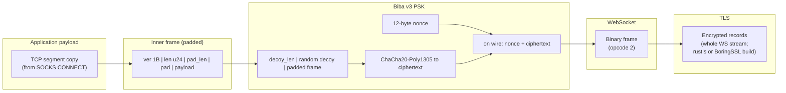
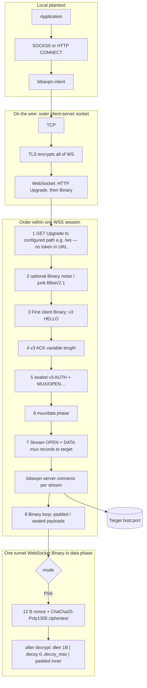

# BibaVPN — protocol and wire formats

BibaVPN is a local **SOCKS5** (and optional **HTTP CONNECT**) front that tunnels
traffic over **TLS + WebSocket** to a remote entry server, which in turn dials
the target `host:port` over **TCP** (with a dedicated mux for **UDP**).

This document specifies the on-wire layers. For install / run instructions see
**[README.md](README.md)**; for contributor notes see **[AGENTS.md](AGENTS.md)**.

---

## Contents

- [Stack at a glance](#stack-at-a-glance)
- [Biba v3 (PSK wire)](#biba-v3-psk-wire)
- [TCP vs UDP paths](#tcp-vs-udp-paths)
- [Wire formats (packets and frames)](#wire-formats-packets-and-frames)
- [End-to-end picture (session flow)](#end-to-end-picture-session-flow)
- [Encrypted invite `biba://`](#encrypted-invite-biba)
- [BibaV4 (v1.2.0) target specification](#bibav4-v120-target-specification)
  - [Implementation status (1.2.x on v3)](#implementation-status-12x-on-v3)

---

## Stack at a glance

How one byte from your app is wrapped before it leaves the machine toward the VPS (TCP tunnel). Each layer is opaque to the one below; DPI on the link sees **TLS record traffic** and, inside it, **WebSocket frames**.



The tunnel expects a **PSK** on both ends. **L5** uses ChaCha20-Poly1305 with
**Biba v3** key derivation and handshake (opaque HELLO/ACK, domain-separated
KDF). Padding length for **L6** can follow **adaptive**, **uniform random**, or
**HTTP-like size buckets** (`--pad-mode`). The **outer** TLS handshake uses
**rustls** by default, or **BoringSSL** when the client is built with Cargo
feature **`boring-tls`** and `--tls-stack boring` (see `tls_util`, `AGENTS.md`).

---

## Biba v3 (PSK wire)

The implementation is **v3-only**: there is no alternate v2 preamble on the
wire. Session setup and control messages differ from older experiments by using
**variable-length** handshake bytes and **single-byte inner opcodes** (carried
inside padded frames, then encrypted — never as bare cleartext on the WebSocket).

### Handshake (after HTTP Upgrade)

After optional **noise** (`--junk-frames`, `--early-ws-frames`), the first
meaningful client → server **Binary** is the v3 **HELLO**:

```text
[V3_HELLO_TAG=0x03][client_random:32][pad_len:u8][random padding 0..pad_len]
```

- `pad_len` is at most **64**; total HELLO length is therefore **not** fixed
  (minimum 34 bytes: tag + random + `pad_len` byte with zero trailing pad).

The server replies with **ACK**:

```text
[server_random:32][mac:16][pad_len:u8][random padding 0..pad_len]
```

- `mac` is a 16-byte tag derived with BLAKE3 over PSK, the shared **domain
  string**, `client_random`, and `server_random` (see `crypto_layer.rs`).
- Trailing padding is also bounded (at most **64** bytes); total ACK length is
  not fixed.

The **domain string** must match on both sides: server `--proto-domain`
(default `default`), client `--proto-domain`, or **SNI** when the client omits
`--proto-domain` / invite `proto_domain`.

### Inner control opcodes (plaintext *inside* the padded frame, then inside AEAD)

After HELLO/ACK, the client sends **AUTH** and channel setup using these
**single-byte** opcodes (see `encode_v3_*` / `decode_v3_*` in `protocol.rs`):

| Opcode (hex) | Meaning |
| ------------ | ------- |
| `0x01` | AUTH — token length `u16` BE + UTF-8 token |
| `0x02` | TCP OPEN — host, port, flags (see `encode_v3_open_with_flags`) |
| `0x03` | UDP channel open (UDP_MUX) — body is exactly this one byte |
| `0x04` | TCP mux channel open (MUX) — body is exactly this one byte |
| `0x10` | OPEN_OK |
| `0x11` | OPEN_ERR — UTF-8 reason |

These replace legacy ASCII `BIBA\x01…` **control** magics for the live protocol.

### UDP inner records (inside AEAD, after UDP_MUX is open)

| Opcode (hex) | Meaning |
| ------------ | ------- |
| `0x05` | UDP_REQ — `xid: u64` BE, SOCKS-like ATYP host/port, payload |
| `0x06` | UDP_REP — same layout; `xid` correlates reply to request |

**ATYP** encoding matches the SOCKS helpers in `protocol.rs` (`encode_atyp_host_port` / `decode_atyp_host_port`).

### UDP mux WebSocket

The **second** TLS+WSS (UDP mux) repeats the same **HELLO → ACK → sealed AUTH →
sealed UDP_MUX (`0x03`)** sequence; datagrams use **`0x05` / `0x06`** as above.

---

## TCP vs UDP paths

```mermaid
flowchart TB
  subgraph client["bibavpn-client"]
    APP[Apps] --> SOCKS[SOCKS5 / HTTP CONNECT]
    SOCKS --> TUN_TCP[TCP: mux driver\n1–4 outer WSS (RR)]
    SOCKS --> TUN_UDP[UDP mux driver\n1 shared WSS]
  end

  subgraph path_tcp["TCP channel (default)"]
    TUN_TCP --> WSS1[TLS + WebSocket]
    WSS1 --> MUXO2[First logical: sealed MUX open\ninner opcode 0x04]
    MUXO2 --> STREAMS[Per-stream mux records\nOPEN target / DATA / CLOSE / WIN]
  end

  subgraph path_tcp_legacy["TCP legacy (--no-mux)"]
    TUN_TCP -.-> WSSL[1 WSS per SOCKS CONNECT]
    WSSL -.-> OPENL[Sealed v3 OPEN host:port]
    OPENL -.-> LOOPL[Padded / sealed payloads]
  end

  subgraph path_udp["UDP channel"]
    TUN_UDP --> WSS2[TLS + WebSocket]
    WSS2 --> MUXO[Sealed UDP_MUX open\ninner opcode 0x03]
    MUXO --> UDPR[UDP_REQ / UDP_REP\ninner 0x05 / 0x06]
  end

  subgraph server["bibavpn-server"]
    STREAMS --> REMOTE_TCP[(Target TCP)]
    LOOPL -.-> REMOTE_TCP
    UDPR --> REMOTE_UDP[(Target UDP)]
  end
```

---

## Wire formats (packets and frames)

### 1) Padded TCP tunnel frame (plaintext inside crypto)

This is what `frame::write_padded_frame` / `write_padded_frame_with_mode` emits. It is the **payload** of a WebSocket **Binary** message inside the ChaCha plaintext (after optional decoy).

**Layout (byte-aligned):**

```text
 offset | 0      | 1 2 3   | 4       | 5 .. 5+pad_len-1 | 5+pad_len .. end |
 +----------+--------+---------+------------------+------------------+
 | field    | ver=1  | len u24 | pad_len | random pad       | payload (len B)  |
 | width    | 1 B    | BE      | 1 B     | 0 .. max_pad     | TCP chunk / inner ctrl |
 +----------+--------+---------+------------------+------------------+
```

### 2) Biba v3 outer wrapper (inside one WebSocket Binary)

After HELLO/ACK, each direction uses **ChaCha20-Poly1305** with a **12-byte nonce** (see `crypto_layer.rs`).

**On the wire:**

```text
 +-------------+------------------------------------------------------+
 | nonce 12 B  | ciphertext = AEAD( plaintext_inner )               |
 +-------------+------------------------------------------------------+
```

**Plaintext inner (before AEAD):**

```text
 +----+--------------+----------------------------------------------+
 | N  | N B decoy    | inner: padded frame, mux record, UDP_REQ/REP … |
 |    | (optional)   |                                              |
 +----+--------------+----------------------------------------------+
      N <= decoy_max
```

### 3) AUTH (token not in URL)

On v3, the token is **`0x01`** + fields **inside the first sealed client frame**
after ACK (not a bare `BIBA…` blob on the WebSocket).

### 4) TCP OPEN (`--no-mux` first logical payload)

Sealed inner **`0x02`** + host/port/flags (see `encode_v3_open_with_flags`).

### 5) TCP mux: capability and stream records

**Channel open (client → server):** sealed inner payload **`[0x04]`** (single byte).

**Mux record (inside one padded inner payload):**

```text
 stream_id u32 BE | flags u8 | payload_len u32 BE | payload
```

Flags include stream open, data, close, RST, and window update (flow control). See `tcp_mux.rs`.

### 6) UDP mux: channel open

**Channel open:** sealed inner **`[0x03]`** (single byte), after HELLO/ACK and AUTH.

### 7) UDP_REQ (client to server)

```text
 0x05  |  xid u64 BE  |  ATYP | address | port u16 BE  |  payload
```

### 8) UDP_REP (server to client)

```text
 0x06  |  xid u64 BE  |  ATYP | src_addr | port u16 BE  |  payload
```

---

## End-to-end picture (session flow)

Top to bottom: **from the app to bytes inside one tunnel frame**. The hop from the app to `bibavpn-client` is **not** BibaVPN-encrypted — plain SOCKS5/CONNECT.

**Default TCP (multiplexed):** **one to four** **TLS + WSS** sessions per client
process (round-robin assignment of new streams when `--ws-parallel` is 2–4); many
SOCKS connections become **mux streams** on those sockets. The same **1..=4** count
applies in **REALITY** mode: each session runs REALITY (X25519) then the mux phase
(plaintext `MUX_OPEN` on the REALITY path — see `local_client` / `reality` modules).



**Legacy TCP (`--no-mux`):** each SOCKS CONNECT opens a **new** WSS; step 6 uses
sealed **OPEN** (`0x02`) instead of MUX + stream records.

DPI on the outside sees **TLS** and **WebSocket**; **inside** Binary is
**nonce + AEAD**. BibaV2.1 may send **WebSocket Ping** and optional **idle dummy**
padded frames.

---

## Encrypted invite `biba://`

The server can print a **single-line encrypted config** after it binds: JSON (`InviteV1`) sealed with **ChaCha20-Poly1305** and a key derived from a **passphrase** (BLAKE3 KDF). Clients and Android JNI can consume the same blob instead of spelling out `--server`, `--token`, and matching tunnel options by hand.

Invite JSON (`InviteV1`) includes **`proto`** (default **`3`**), optional **`proto_domain`** (omit to let the client default the KDF label to **SNI** — must match server `--proto-domain` in effect), plus **`ws_path`**, **`pad_mode`**, **`dummy_interval_secs`**, optional **`tls_stack`** (`rustls` | `boring`), optional **`pin_cert_pem`**, optional REALITY fields (`reality_target`, `reality_public_key`, `reality_short_id`), and other tunnel fields. **`--print-invite-uri`** on the server embeds the same defaults as hand-written JSON. **`bibavpn-mint-invite`** uses environment variables (`INVITE_PROTO`, `INVITE_PROTO_DOMAIN`, …) with the same v3-first defaults. **Do not** paste real invites or passphrases into tickets or public logs.

**Server** (stdout = only the URI; passphrase must stay secret — share out-of-band):

```bash
./target/release/bibavpn-server \
  --listen 0.0.0.0:8443 --self-signed-san vpn.example.com \
  --token "$BIBA_VPN_TOKEN" --psk "$BIBA_VPN_PSK" --decoy-max 32 --max-pad 64 \
  --ws-path /ws \
  --print-invite-uri \
  --invite-passphrase "$BIBA_INVITE_PASSPHRASE" \
  --invite-public 'YOUR_VPS_PUBLIC_IP:8443' \
  --invite-sni 'vpn.example.com'
```

**Client** (mutually exclusive with `--server` / `--token`):

```bash
./target/release/bibavpn-client \
  --from-invite 'biba://...' \
  --invite-passphrase "$BIBA_INVITE_PASSPHRASE" \
  --socks5 127.0.0.1:1080
```

---

## Biba v3 summary

- **PSK required** on client and server. **`--proto`** is **`3`** (only supported value).
- **Handshake:** variable-length HELLO (`0x03` …) and ACK (32 + 16 MAC + padding); see [Handshake](#handshake-after-http-upgrade).
- **Session keys:** `bibavpn.v3.c2s` / `bibavpn.v3.s2c` with PSK + domain + both randoms.
- **Control:** single-byte opcodes `0x01`…`0x04`, `0x10`/`0x11` **inside AEAD** after the handshake.
- **UDP datagrams:** inner **`0x05` / `0x06`** records with SOCKS-like addressing.

## REALITY (WSS path)

BibaVPN implements a **REALITY-style front** on the **WebSocket transport**, not inside the TLS
ClientHello the way [Xray REALITY](https://github.com/XTLS/REALITY) does. Use this when you want
the **outer TLS SNI** and HTTP `Host` to match an allowlisted front domain while TCP still lands
on your VPS.

**Session order (TCP mux + REALITY):**

1. Client → VPS: **TLS** (SNI = front domain from `reality_target`) + **WSS** upgrade on `--ws-path`.
2. **REALITY binary exchange** on the WebSocket (before v3 PSK on this path):
   - Client → server: `[version:1][client_ephemeral_x25519:32][short_id:8]`
   - Server → client: `[version:1][server_long_term_x25519:32]` (must match invite `reality_public_key`)
3. Client sends plaintext **`MUX_OPEN`**; mux streams carry target TCP (no v3 HELLO/AUTH on this path).

**Server CLI**

```bash
bibavpn-server \
  --reality-target 'vk.com:443' \
  --reality-private-key "$REALITY_PRIV_B64" \
  --reality-short-ids '0123456789abcdef'   # optional; omit = any; 000…000 = wildcard
```

Generate keys in Rust (`RealityServerConfig::generate_keys()`), or from any X25519 tool; publish
the **public** key and a **short ID** in the client invite. **SpiderX** (background GETs to the
target) starts automatically when REALITY is enabled — warms camouflage against the front host.

**Client / invite fields**

| Field | Meaning |
| ----- | ------- |
| `reality_target` | Front reference, e.g. `vk.com:443` — sets outer **SNI** unless `--sni` overrides |
| `reality_public_key` | Base64, 32-byte X25519 public key (pin against MITM) |
| `reality_short_id` | 16 hex digits (8 bytes); must match server allowlist when configured |

**Build note:** outer TLS may use **`--tls-stack rustls`** (default) or **`boring`** (build with
`--features boring-tls`). **`--pin-cert`** works on both. REALITY does **not** replace VPS IP
allowlists — it aligns **SNI / handshake behaviour**, not routing to the front site's IP.

**Tests:** `cargo test -p bibavpn --test reality_handshake` (WSS + X25519 roundtrip).

## BibaV2.1 transport knobs

These options shape TLS/WebSocket timing and framing; they apply on top of the v3 tunnel.

- `--ws-ping-secs`, `--ws-ping-jitter-percent`, `--ws-binary-send-jitter-ms`
- `--ws-jitter-min-ms` / `--ws-jitter-max-ms` — per-frame send delay range (replaces
  uniform `--ws-binary-send-jitter-ms` when min/max are set); presets may fill
  these when both min and max are left at **0** (`stealth_v12` / `apply_preset_ws_jitter`)
- `--max-ws-binary` — cap outgoing WS binary; mux code reserves **9 bytes** for the mux record header when chunking TCP.
- `--udp-max-pad`, `--udp-max-ws-binary`, `--udp-mux-reply-timeout-secs`
- `--ws-host`, `--ws-origin`, `--ws-user-agent`, `--ws-accept-language`, `--ws-header`
- `--early-ws-frames`, `--junk-frames`
- `--pin-cert` (client) — incompatible with `--insecure`; leaf PEM pinning on **rustls** and
  **boring** (`boring-tls` build)
- `--tls-stack rustls|boring` (client) — build with `cargo build -p bibavpn --features boring-tls` for Boring
- `--tls-fragment` — record-size hint where the TLS stack supports it (see `tls_util`)
- `--ws-path` — WebSocket path; token via sealed **AUTH** (default `/ws`)
- `--legacy-path-auth` (server) — accept old `/b/{token}` without sealed AUTH (less safe)
- `--pad-mode adaptive|random|http-buckets`
- `--stealth-profile default|balanced|aggressive` — fills padding/jitter/decoy/idle
  defaults when explicit CLI values are unset (see `stealth_v12`)
- `--fingerprint` / TLS profile — resolved with `tls_profile` and invite in a
  fixed order (`client_policy`); final default client label is **Chrome 132+**
- `--ws-parallel` **1..=4** — parallel outer WSS + mux stream round-robin (including **REALITY**: one REALITY+`MUX_OPEN` stack per outer session)
- `--dummy-interval-secs` — idle empty padded frames (`0` = off)
- `--decoy-gets`, `--decoy-gets-interval-secs`, `--decoy-gets-paths` — client-only decoy HTTPS fetches
- `--idle-decoy-secs` — when the mux is idle longer than this threshold, run short
  background HTTPS decoys (merged with `--stealth-profile` defaults)
- **Server:** `--server-ack-delay-min-ms` / `max`, `--rtt-mask-jitter-ms`, optional
  `--ack-profile balanced|aggressive` when the explicit millisecond args are all zero
- `--camouflage-dir`, `--camouflage-url` (`http://` upstream only) — server camouflage

Wire-format changes require **both** client and server updates. Pure client-side
or server-side **timing / TLS engine** options do not change the v3 opcodes
above, but all peers must use compatible `bibavpn` versions when new flags are required.

---

## BibaV4 (v1.2.0) target specification

This section is the **normative product spec** for the `v1.2.0` / BibaV4 line.
**Backward compatibility is not required** for a *future* BibaV4 wire: BibaV4
may still replace the Biba v3 handshake, inner opcodes, padding, mux layout, and
invite fields. The **on-the-wire byte layout** will be documented here as
subsystems merge; **today’s releases** in this repository still use the **Biba
v3** opcodes in the sections above and implement many BibaV4 *behaviors* as
client/server layers on that wire (see **Implementation status** below).

**Design goal:** position BibaVPN among the stronger **single-VPS,
DPI-resistant** tunnels in 2026 (Rust core, TLS + WebSocket, Android app), with
focus on **DPI bypass** (not anonymity against the VPS operator).

### Implementation status (1.2.x on v3)

Rough mapping from the P0 / P1 bullets below to the **current tree** (not an
exhaustive changelog):

- **P0 TLS:** optional **BoringSSL** build (`boring-tls` + `--tls-stack boring`)
  for record-size control and production **`--pin-cert`** on the Boring path;
  **`rustls` remains the default** and does not provide full JA3 parity by itself.
- **P0 REALITY (WSS):** X25519 exchange after WSS; pinned pubkey in invite; auto SNI from
  `reality_target`; integration test `reality_handshake.rs`. **Not** Xray TLS-hook REALITY.
- **P0 RTT:** **delayed ACK** and **RTT mask jitter** on the server; **1–4 WSS** +
  **round-robin** in `tcp_mux` (v3 and REALITY both use the same pool pattern).
- **P0 padding / jitter:** `PadMode::Adaptive`; WebSocket **min/max ms** jitter;
  **stealth presets** (`stealth_v12`) align defaults.
- **P0 decoys:** **idle** decoys after a configurable **idle** threshold
  (defaults merged from presets, often **10 s** for balanced/aggressive) plus
  existing **parallel** `decoy_gets` — a full “browser” catalog per spec is not
  guaranteed here.
- **P0 desync:** `DesyncConfig` and parsing exist; most raw-socket modes need OS
  support and remain **aspirational** until hooked up.
- **P1 HTTP/2 WebSocket, IP ID, UDP length games:** **not** implemented as
  described in the bullets below — still **roadmap** relative to this tree.

**Benchmarks (example):** on one WSL loopback run (64 MiB, `scripts/bench-wsl-2026-04-20.txt`)
direct HTTP reached ~**932** MB/s vs SOCKS+WSS ~**311** MB/s; use
`scripts/wsl-local-bench.sh` for before/after comparisons, not as an absolute
ceiling. Target **≤ ~10%** regression vs your baseline when changing the hot path
(see **Acceptance**).

### P0 — TLS fingerprint mimicry + randomized ClientHello

- Move or add a **BoringSSL-class** TLS path (e.g. `tokio-boring` / similar) or
  an approved alternative that exposes **full ClientHello construction** (GREASE,
  randomized extension order, custom extensions).
- CLI: `--fingerprint chrome-132 | firefox-136 | safari-18 | random` (default:
  Chrome 132+ class profile for 2026).
- Optional **record fragmentation:** `--tls-fragment` splits **ClientHello** and
  (where applicable) **TLS application data** across **2–4** TCP segments.

**Note:** Today’s `rustls`-only path can at best align cipher order and ALPN;
true JA3/JA4 parity requires byte-level control (see `tls_util.rs` comments).

### P0 — Cross-layer RTT fingerprint (mitigation)

- **Server:** configurable **delayed ACK buffer** (e.g. 40–500 ms) in the async
  runtime.
- **Client + server:** **2–4 parallel WebSocket** sessions with a **round-robin**
  balancer feeding the same logical mux.
- **Flags:** `--rtt-mask` (artificial jitter on ACK / timing paths).
- **Decoy targets** chosen for **high natural RTT variance** to dilute
  cross-layer timing classifiers (per NDSS-class threat models).

### P0 — Adaptive burst padding + traffic shaping

- New default: `--pad-mode adaptive` — mimic **HTTP/2 Chrome/Firefox burst
  patterns** (e.g. first **5–7** frames in a **900–1400** byte band, then
  smaller deferred packets).
- **All** WebSocket outbound frames: `--ws-jitter` in a **5–25 ms** band
  (uniform or distribution TBD in implementation).

### P0 — Browser-like decoy simulator

- `--decoy-mode browser`: built-in list of real sites + matching **User-Agent**,
  **Referer**, cookie-like headers.
- On **idle > N seconds** (default target **10 s**), run **short** background
  sessions (**2–4** requests with **100–300 ms** pauses).

### P0 — Client-side packet desync (userspace)

- `--desync-mode split2 | fakedsplit | disorder`
- Optional **fake ClientHello** injection with **low TTL** (1–5).
- TCP segmentation + **junk TCP options** (`--fooling md5sig | badseq | badsum`
  — exact set TBD).
- Implemented in **userspace** (`tokio` + **raw/raw-like** sockets where the OS
  allows). **Requires elevated privileges** on most platforms; see
  [SECURITY.md](SECURITY.md).

#### External desync (typical deployment)

The stock **bibavpn-client** build does **not** perform raw-socket split / disorder / fake-handshake inside the process: `--desync-mode` and related knobs are **advisory** (they record intent, emit guidance, and keep room for future hooks). For paths that need real desync, operators usually run an **external** helper in front of the TCP session (for example **zapret**-style `nfqws` / `tpws`), then connect the client through that path. Code: `bibavpn::transport_capabilities::effective_desync_mode`; logs: tracing target `bibavpn_stealth`.

### P1 (v1.2.0 or v1.2.1)

- WebSocket upgrade over **HTTP/2** (`--transport http2`) with **HTTP/1.1**
  fallback.
- Adaptive host/header spoofing (`--hostspell`, `--hostcase`, random
  subdomains).
- **IP ID** + **TTL** randomization (`--ip-id rnd | seqgroup`, `autottl`).
- UDP mux: length desync and fake **QUIC/DHT**-like patterns.

### Acceptance (product)

- CI: **docker-compose** lab with **zapret** (`nfqws` / `tpws`) and captured
  pcaps for regression.
- Manual: **TSPU** (RU) and **GoodbyeDPI**-class paths where legally and safely
  testable.
- **Benchmarks:** throughput must not regress more than **~10%** vs baseline on
  the project’s local bench scripts.
- **Tests:** unit + integration for each new subsystem; **Changelog** + **release
  notes** at ship time.

Invite / JSON / `proto` field will move to a **BibaV4** identifier when the wire
lands (exact value and migration are implementation-defined in this branch).
