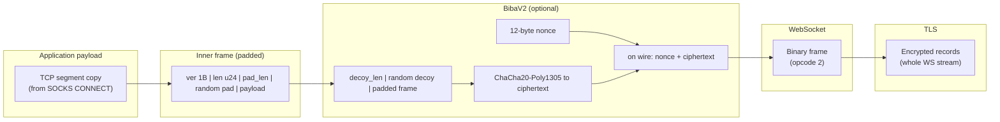
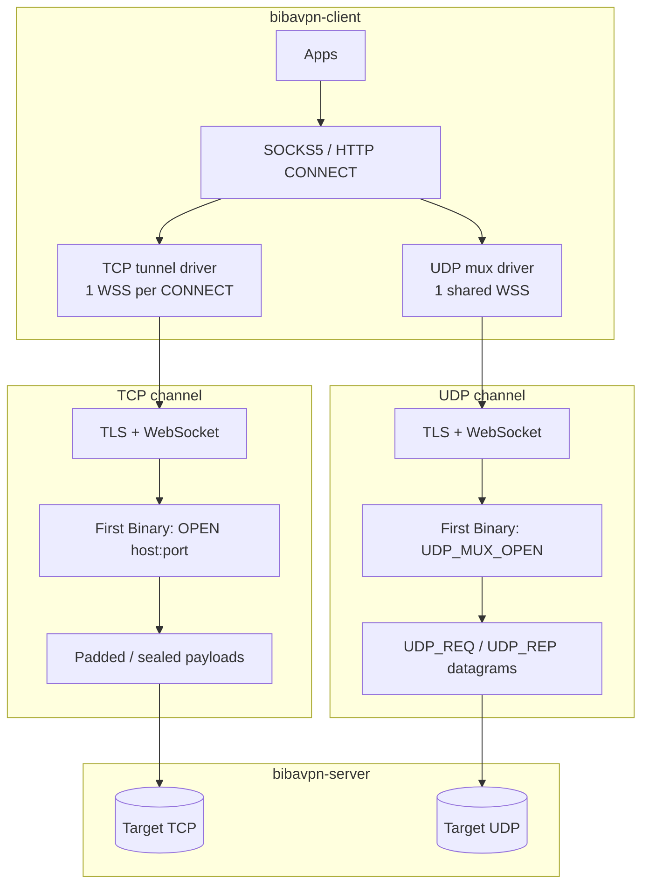
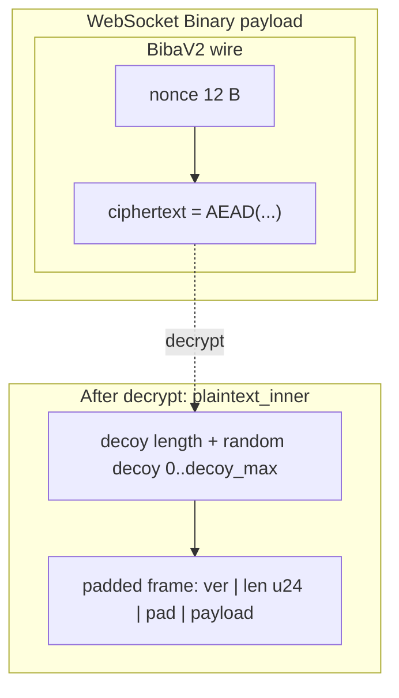
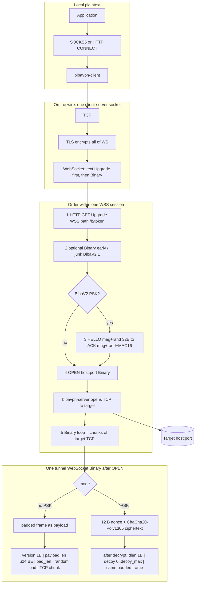

# BibaVPN

Local **SOCKS5** and optional **HTTP CONNECT** over **TLS + WebSocket** to an entry server; the server opens outbound **TCP** (and **UDP** via a dedicated mux) to the target `host:port`. Optional **BibaV2**: shared PSK, HELLO/ACK, ChaCha20-Poly1305, and random decoy per frame. **BibaV2.1** adds a max WS binary size, periodic WebSocket Ping (with optional jitter), configurable upgrade headers, early-session noise, optional **TLS leaf pinning** (`--pin-cert`), and UDP-mux-specific limits.


|                         |                                                   |
| ----------------------- | ------------------------------------------------- |
| Developer / agent guide | [AGENTS.md](AGENTS.md)                            |
| Local Docker lab        | `docker compose -f docker-compose.yml up --build` |


---

## Contents

- [Stack at a glance](#stack-at-a-glance)
- [TCP vs UDP paths](#tcp-vs-udp-paths)
- [Wire formats (packets and frames)](#wire-formats-packets-and-frames)
- [End-to-end picture (session flow)](#end-to-end-picture-session-flow)
- [Encrypted invite `biba://`](#encrypted-invite-biba)
- [Build](#build)
- [Security](#security)
- [Repository](#repository)

---

## Stack at a glance

How one byte from your app is wrapped before it leaves the machine toward the VPS (TCP tunnel). Each layer is opaque to the one below; DPI on the link sees **TLS record traffic** and, inside it, **WebSocket frames**.



Without PSK, **L5** is skipped: the WebSocket Binary payload **is** the padded frame from **L6**.

---

## TCP vs UDP paths



---

## Wire formats (packets and frames)

### 1) Padded TCP tunnel frame (plaintext inside crypto, or plain mode)

This is what `frame::write_padded_frame` emits. It is the **payload** of a WebSocket **Binary** message in plain mode; in PSK mode it sits **after** decoy inside the ChaCha plaintext (see section 2).

**Layout (byte-aligned):**

```text
 offset | 0      | 1 2 3   | 4       | 5 .. 5+pad_len-1 | 5+pad_len .. end |
 +----------+--------+---------+------------------+------------------+
 | field    | ver=1  | len u24 | pad_len | random pad       | payload (len B)  |
 | width    | 1 B    | BE      | 1 B     | 0 .. max_pad     | TCP chunk / OPEN |
 +----------+--------+---------+------------------+------------------+
```

**Schematic (single strip):**

```text
 +------+------------+-------+------------------+----------------------------+
 | 0x01 | LL LL LL   |  pp   | pp bytes noise   | application data (len B)   |
 +------+------------+-------+------------------+----------------------------+
          payload_len (24-bit BE)   optional padding (pp = pad_len)
```

### 2) BibaV2 outer wrapper (inside one WebSocket Binary)

After HELLO/ACK, each direction uses **ChaCha20-Poly1305** with a **12-byte nonce** (see `crypto_layer.rs`).

**On the wire:**

```text
 +-------------+------------------------------------------------------+
 | nonce 12 B  | ciphertext = AEAD( plaintext_inner )               |
 +-------------+------------------------------------------------------+
```

**Plaintext inner (before AEAD):**

```text
 +----+--------------+----------------------------------------------+
 | N  | N B decoy    | inner: padded frame, OPEN, UDP_REQ, UDP_REP, ... |
 |    | (optional)   |                                                  |
 +----+--------------+----------------------------------------------+
      N <= decoy_max
```

**Nested view (PSK mode, one WebSocket Binary carrying TCP data):**



### 3) TCP OPEN (first logical binary after optional junk / HELLO)

```text
 "BIBA\x01OPEN\x00"  |  host_len u16 BE  |  host UTF-8  |  port u16 BE
 +---- 9 bytes -----+
```

### 4) UDP mux: channel open

```text
 "BIBA\x01UDPM\x00"     (9 bytes, fixed)
```

### 5) UDP_REQ (client to server)

```text
 "BIBA\x01UDPR\x00"  |  xid u64 BE  |  ATYP | address | port u16 BE  |  payload
```

**ATYP** (SOCKS-like): `1` + IPv4 (4 B) + port; `3` + len + hostname + port; `4` + IPv6 (16 B) + port.

### 6) UDP_REP (server to client)

```text
 "BIBA\x01UDPQ\x00"  |  xid u64 BE  |  ATYP | src_addr | port u16 BE  |  payload
```

---

## End-to-end picture (session flow)

Top to bottom: **from the app to bytes inside one tunnel frame**. The hop from the app to `bibavpn-client` is **not** BibaVPN-encrypted — plain SOCKS5/CONNECT. Each new app connection to a site is usually a **new** TLS+WSS session to the server.



DPI on the outside sees ordinary **TLS** and **WebSocket**; **inside** Binary is either a **padded TCP** slice or **nonce + AEAD** over decoy + padded TCP. In parallel, BibaV2.1 may send **WebSocket Ping** to keep the session alive.

---

## Encrypted invite `biba://`

The server can print a **single-line encrypted config** after it binds: JSON (`InviteV1`) sealed with **ChaCha20-Poly1305** and a key derived from a **passphrase** (BLAKE3 KDF). Clients and Android JNI can consume the same blob instead of spelling out `--server`, `--token`, and matching tunnel options by hand.

**Server** (stdout = only the URI; passphrase must stay secret — share out-of-band):

```bash
./target/release/bibavpn-server \
  --listen 0.0.0.0:8443 --self-signed-san vpn.example \
  --token YOUR_TOKEN --psk YOUR_PSK --decoy-max 32 --max-pad 64 \
  --print-invite-uri \
  --invite-passphrase 'shared-out-of-band-secret' \
  --invite-public 'YOUR_VPS_PUBLIC_IP:8443' \
  --invite-sni 'vpn.example'
```

**Client** (mutually exclusive with `--server` / `--token`):

```bash
./target/release/bibavpn-client \
  --from-invite 'biba://...' \
  --invite-passphrase 'shared-out-of-band-secret' \
  --socks5 127.0.0.1:1080
```

The invite carries tunnel parameters (token, PSK, pad/decoy, WS limits, optional UDP profile hints, `insecure` for demo self-signed, etc.). **Do not** paste real invites or passphrases into tickets or public logs.

---

## Build

```bash
cargo build --release -p bibavpn --bin bibavpn-server
cargo build --release -p bibavpn --bin bibavpn-client
```

CLI flags, remote-server examples, Docker notes, and deploy gotchas live in **[AGENTS.md](AGENTS.md)**. Legacy bookmark: [AGENT.md](AGENT.md).

Workspace crates also include `bibavpn-jni` (Android JNI) and `bibavpn-desktop` (desktop helper); see `android/` for the Android app.

---

## Security

Treat PSK, path token, and **invite passphrase** as **secrets** — do not commit them. For production use proper certificates, **`--pin-cert`** (or a public CA you trust), and avoid **`--insecure`** on the client.

---

## Repository

Rust stack; protocol modules and layout are documented in [AGENTS.md](AGENTS.md) (BibaV2 / BibaV2.1, UDP mux, scripts).
