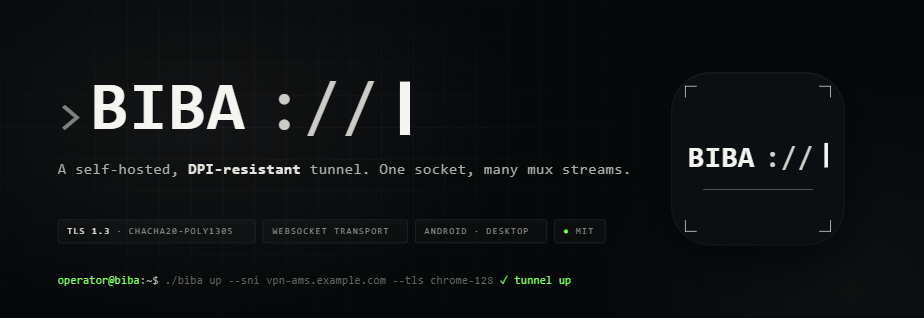

<p align="center">
  
</p>

<h1 align="center">BibaVPN</h1>

<p align="center">
  <strong>Your VPS. Your tunnel.</strong><br>
  A self-hosted Rust tunnel built to make traffic harder to classify.
</p>

<p align="center">
  <a href="https://github.com/Eljaja/BibaVPN/releases/latest"></a>
  <a href="LICENSE"></a>
  <a href="https://hub.docker.com/r/eljaja/bibavpn-server"></a>
</p>

<p align="center">
  <a href="#download"><strong>Download the app</strong></a> ·
  <a href="#quick-start">Try it locally</a> ·
  <a href="#self-host-on-a-vps">Self-host</a> ·
  <a href="https://github.com/Eljaja/BibaVPN/discussions">Ask a question</a>
</p>

BibaVPN carries your apps' **SOCKS5 and HTTP CONNECT traffic over TLS + WebSocket** to a server you control. Bring one VPS, connect a client, and tune the tunnel for your network — with desktop and Android apps, encrypted invitations, and a Rust core you can inspect.

> **Experimental, actively evolving.** The protocol is not frozen and has not had a third-party security audit. DPI resistance depends on your network and configuration; it is not a guarantee of undetectability. [Read the security notes](#security).

## Why BibaVPN?

- **Run your own exit server.** Host the server on a VPS you choose and manage your own credentials.
- **Connect with an invitation.** Import an encrypted `biba://` URI and enter its passphrase instead of copying a page of settings.
- **Work with the apps you already use.** Local SOCKS5 and optional HTTP CONNECT endpoints support browsers and proxy-aware tools; SOCKS5 UDP relay covers UDP traffic too.
- **Tune how the tunnel looks on the wire.** Adjust padding, timing jitter, decoy traffic and TLS profiles. Serve a camouflage website on the same TLS port.
- **Reuse connections.** Multiplex TCP streams across 1–4 WebSocket sessions, with a separate session for UDP relay.
- **Inspect and extend it.** MIT-licensed Rust client and server, a documented wire protocol, and shared desktop/Android app code.

## Download

**Already have an invitation?** Install a client, import your `biba://` URI, enter the passphrase, and connect. You need access to a BibaVPN server; the app does not include a hosted VPN subscription.

| Platform | Download | Package |
| --- | --- | --- |
| Android | [Download APK](https://github.com/Eljaja/BibaVPN/releases/latest/download/BibaVPN-android-debug.apk) | ARM64 debug build; sideload |
| Windows | [Download ZIP](https://github.com/Eljaja/BibaVPN/releases/latest/download/BibaVPN-windows-x64.zip) | x64; extract before launching |
| macOS | [Download DMG](https://github.com/Eljaja/BibaVPN/releases/latest/download/BibaVPN-macos-aarch64.dmg) | Apple Silicon |
| Linux | [Choose a package](https://github.com/Eljaja/BibaVPN/releases/latest) | x86_64 AppImage or `.deb` |
| Server / CLI | [Docker quick start](#quick-start) · [Build from source](#build-from-source) | Self-hosted Rust binaries |

Windows may need the Microsoft Edge WebView2 Runtime. **iOS is unfinished:** the Packet Tunnel extension does not forward traffic yet. See [app development notes](apps/AGENTS.md) for build details and [release notes](https://github.com/Eljaja/BibaVPN/releases) for changes.

## Quick start

Try the complete tunnel locally using prebuilt Docker images — no Rust build or VPS needed.

**You need:** Linux or WSL, Git, Docker with Compose, OpenSSL, and curl. Keep these commands in the same terminal so Compose can read the generated secrets. Ports `8443`, `11080`, and `11880` must be free.

```bash
git clone https://github.com/Eljaja/BibaVPN.git
cd BibaVPN

export BIBA_VPN_TOKEN="$(openssl rand -hex 16)"
export BIBA_VPN_PSK="$(openssl rand -hex 32)"

docker compose -f docker-compose.hub.yml up -d
```

This starts **both the server and client**. Once they are ready, send a request through either local proxy:

```bash
# SOCKS5, including DNS resolution through the proxy
curl --fail --socks5-hostname 127.0.0.1:11080 https://ifconfig.io

# HTTP CONNECT
curl --fail --proxy http://127.0.0.1:11880 https://ifconfig.io
```

Both commands should print the public IP used by the Docker host. In this local demo it can match your normal IP; with a remote server, it will be that server's exit IP. The proxy endpoints bind to localhost.

> This Compose setup uses a self-signed certificate and `--insecure` for a local lab. For a remote server, use verified TLS or certificate pinning as described below.

Stop and remove the lab containers when done:

```bash
docker compose -f docker-compose.hub.yml down
```

<details>
<summary><strong>Prefer to build the Docker images locally?</strong></summary>

From the repository root:

```bash
bash start.sh --build
docker compose --env-file .biba-start.env -f docker-compose.yml up -d --build biba-client
```

`start.sh` generates secrets in `.biba-start.env`, starts the **server only**, and prints an invitation and passphrase. The second command starts the client for the same curl checks above. Unlike the prebuilt-image lab, this Compose file publishes the proxy ports on all host interfaces: use it on an isolated development host.

Keep `.biba-start.env` private. Rerunning `start.sh` replaces its secrets; recreate the client afterwards. Stop this lab with:

```bash
docker compose --env-file .biba-start.env -f docker-compose.yml down
```

</details>

## How it works

```text
Your apps → BibaVPN client ═══ TLS + WebSocket ═══ Your VPS → Internet
             SOCKS5 /          encrypted tunnel    BibaVPN
           HTTP CONNECT                            server
```

The CLI exposes local proxy endpoints; route the apps you want through them. It does not automatically capture every connection on your device. Android integrates with the system VPN service.

The default tunnel adds **ChaCha20-Poly1305 encryption, authenticated control frames and padding** inside TLS. TCP streams share outer WebSocket sessions; SOCKS5 UDP uses a separate one. For the exact handshake and framing, read [PROTOCOL.md](PROTOCOL.md).

## Self-host on a VPS

You need a reachable VPS, a hostname pointing to it, and a TLS certificate and private key for that hostname. The example below terminates TLS directly in BibaVPN on TCP port `8443`; allow that port in your firewall. Build the binaries first using [the source instructions](#build-from-source).

**On the server**, generate credentials once and keep them private:

```bash
export BIBA_HOST="vpn.example.com"  # Replace with your hostname
export BIBA_VPN_TOKEN="$(openssl rand -hex 16)"
export BIBA_VPN_PSK="$(openssl rand -hex 32)"

./target/release/bibavpn-server \
  --listen 0.0.0.0:8443 \
  --cert /path/to/fullchain.pem --key /path/to/privkey.pem \
  --token "$BIBA_VPN_TOKEN" --psk "$BIBA_VPN_PSK"
```

Replace the certificate paths with readable PEM files. **On your client machine**, set `BIBA_HOST`, `BIBA_VPN_TOKEN`, and `BIBA_VPN_PSK` to the same values through a private channel, then run:

```bash
./target/release/bibavpn-client \
  --server "$BIBA_HOST:8443" --sni "$BIBA_HOST" \
  --token "$BIBA_VPN_TOKEN" --psk "$BIBA_VPN_PSK" \
  --socks5 127.0.0.1:1080
```

TLS verification is enabled by default. For a self-signed certificate, securely copy the server's public leaf certificate to the client and add `--pin-cert /path/to/leaf.pem`; keep verification enabled.

<details>
<summary><strong>Invite another device without copying CLI settings</strong></summary>

Generate a separate invitation passphrase on the server:

```bash
export BIBA_INVITE_PASSPHRASE="$(openssl rand -hex 24)"
```

Restart the server with these additional flags appended to its command:

```bash
--print-invite-uri \
--invite-passphrase "$BIBA_INVITE_PASSPHRASE" \
--invite-public "$BIBA_HOST:8443" \
--invite-sni "$BIBA_HOST"
```

Import the printed `biba://` URI into the app, or pass it to the CLI with `--from-invite 'biba://…'` and `--invite-passphrase`. Send the passphrase through a separate private channel. [Invitation format and options](PROTOCOL.md#encrypted-invite-biba).

</details>

## Using the tunnel

For the VPS example, the local SOCKS5 endpoint is `127.0.0.1:1080`. For the Docker lab, use port **`11080`** instead.

| Application | Setup |
| --- | --- |
| Firefox | Network Settings → Manual proxy → SOCKS Host `127.0.0.1`, port `1080`, SOCKS v5; enable **Proxy DNS when using SOCKS v5** |
| Chrome / Chromium | Launch with `--proxy-server="socks5://127.0.0.1:1080"` |
| curl | `curl --socks5-hostname 127.0.0.1:1080 https://ifconfig.io` |
| Proxy-aware CLI tools | Set `ALL_PROXY=socks5h://127.0.0.1:1080` where supported; this is not a system-wide VPN switch |

Need HTTP CONNECT? Add `--http-proxy 127.0.0.1:8080` to the CLI client. The Docker lab already exposes it on `127.0.0.1:11880`.

## Configuration

Start with the defaults, then adjust only what your network needs. Run either binary with `--help` for its full option list; [AGENTS.md](AGENTS.md#transport-and-websocket-knobs) explains the transport controls.

| Goal | Options |
| --- | --- |
| Tune traffic shaping | `--stealth-profile`, `--pad-mode`, `--decoy-max`, `--max-pad`, `--idle-decoy-secs`, `--ws-jitter-min-ms`, `--ws-jitter-max-ms` |
| Use multiple TCP tunnel sessions | Client `--ws-parallel` (`1`–`4`) |
| Choose a TLS profile / engine | Client `--fingerprint`, `--tls-stack rustls\|boring`; BoringSSL requires a `boring-tls` build |
| Serve a camouflage site | Server `--camouflage-dir` or `--camouflage-url http://…`; private origins require `--camouflage-allow-private` |
| Adjust server timing | `--ack-profile`, `--server-ack-delay-min-ms`, `--server-ack-delay-max-ms`, `--rtt-mask-jitter-ms` |
| Pin the server certificate | Client `--pin-cert`; supported by both TLS engines |

The server and client must agree on token, PSK, WebSocket path and protocol domain (`--proto-domain`, default `default`). The default path is `/ws`; authentication credentials are carried inside the encrypted tunnel, not in the URL.

Optional **REALITY mode** is BibaVPN's own WSS handshake, not Xray REALITY compatibility. See [protocol details](PROTOCOL.md#reality-wss-path). Browser-like profiles and desync controls have implementation limits; consult the [current capabilities and roadmap](AGENTS.md#stealth-dpi-and-roadmap) before relying on them.

## Build from source

Clone the repository as shown in [Quick start](#quick-start). With Rust installed, run these commands from the repository root on Linux or WSL; `rust-toolchain.toml` selects the compiler:

```bash
cargo build --release -p bibavpn --bin bibavpn-server --bin bibavpn-client
cargo test -p bibavpn -p biba --locked
```

Optional BoringSSL client (also needs native build tools such as CMake and NASM):

```bash
cargo build --release -p bibavpn --features boring-tls --bin bibavpn-client
```

Then select `--tls-stack boring`. Desktop and mobile build instructions live in [apps/AGENTS.md](apps/AGENTS.md); the repository layout is in [AGENTS.md](AGENTS.md#repository-layout).

## Security

BibaVPN is experimental software for people comfortable operating their own tunnel. It has **no third-party security audit** and makes no anonymity or universal DPI-bypass guarantee.

- Use verified TLS or pin the server certificate. `--insecure` is for local tests only.
- Keep tokens, PSKs, invitation passphrases and private keys out of Git and public reports. Rotate exposed credentials.
- Your VPS is the exit point: its operator can observe destinations and traffic metadata. End-to-end HTTPS still protects application contents; plaintext application traffic remains visible at the exit.
- `--legacy-path-auth` is a weaker compatibility mode; use the default authenticated tunnel instead.

Report vulnerabilities privately using [SECURITY.md](SECURITY.md).

## Help BibaVPN grow

**If BibaVPN is useful to you, give the repository a ⭐.** It helps other self-hosters discover the project and lets us know you want to see it grow.

You can also help without writing code: report how it behaves on your network, improve the setup instructions, or share it with someone who runs their own VPS. Remove secrets and identifying details from logs before posting.

- [Ask a question or share feedback](https://github.com/Eljaja/BibaVPN/discussions)
- [Report a bug](https://github.com/Eljaja/BibaVPN/issues) — include the version, platform, expected result and reproduction steps
- [Contribute a fix](CONTRIBUTING.md) — small, focused pull requests are welcome

## License

[MIT](LICENSE). Third-party components retain their own licenses.
